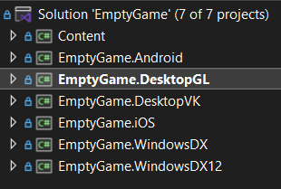
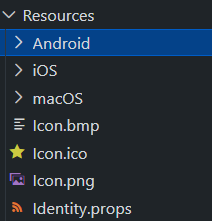
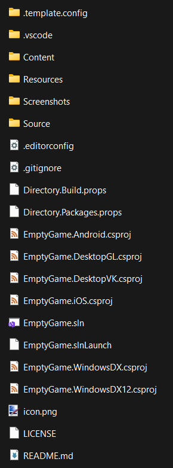
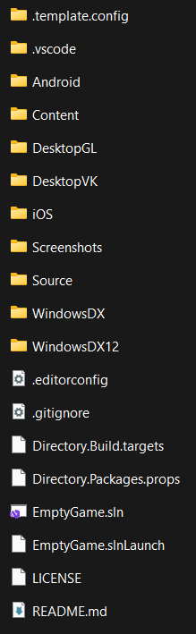

# MonoGame.EmptyGame.CSharp

New "Empty Project" example templates.

## The problem today

Currently MonoGame ships a multitude of templates, all focused on a single platform with contained content delivery using the legacy MGCB approach.  There are two "multi-platform" templates (one set for MGCB and one for the new Content Builder), but these also create a problem where there is no choice involved and it is up to the developer to delete those platforms they are not using.

To move project creation forward a cleaner better path is needed, one where:

- A developer can CHOOSE the platforms they want to build for in a single template
- Resources and identity are shared between platforms, cutting down duplication.
- A best practice approach to sharing code for multiple platforms, whilst also providing guidance when platform specific functionality is needed.
- Simplification, ONE template to rule them all

To this end, the team have been working hard on a few possible solutions to this problem and we need the community to weigh in on the favoured path.

Ultimately the choice comes down to two distinct layout options for a project structure:

- A [Single folder with content](#single-folder-template).
- A [folder with dedicated sub folders for each platform and shared content](#platform-structured-template).

## Base concepts of redesign

To address the core reusability of a single template, the following core approaches have been used, leveraging off the capabilities nested within the DotNet framework, namely:

- Shared identity for all platforms through a [shared `identity.props`](https://learn.microsoft.com/en-gb/visualstudio/msbuild/customize-your-build) (optional)
- DeDuped assets - all platforms share a "Resources" folder with unique assets.  With sub folders for dedicated platforms (see below)
- Safe Name protection built in, included in the `template.json` - Now bad names result in a helpful error, not a bad project.
- Guid Generation - Ensuring all titles and platforms when generated from the template receive new unique Guid's.
- Unified NuGet package definitions (`directory.packages.props`) - all versions for dependencies and MonoGame in one file, not scattered across projects, including a single MonoGame version.  Platforms just state what name of package to use.
- Platforms can be added/removed far easier without direct impact to the solution or builds.

These patterns have been applied to the two example layouts below.

## Solution view

The critical thing that is unified for both approaches below is the Solution layout, this remains the same regardless of which path is chosen.  Here, All the projects in the Game solution are listed along side the Content project.

The only real difference between the templates is the folder structure behind them.

> [!NOTE]
> Although a debate has ranged on whether the Game name should be listed in each projects name or not, "EmptyGame.Desktop" or simply "Desktop", which is easier, you weigh in.

## Base Folders

Beyond the platforms, three core folders are recommended as the "Best Practice" for managing your project, namely:

- Source - This is where your game code lives
- Content - This is where your game assets lives
- Resources - This is where your projects identity and marketing are maintained.

The aim here is to have purpose to areas of your solution, broken apart from whatever platforms you intend to support for your project.  Again, this is just an optional start, you can obviously manage your project however you wish after creation.

> [!NOTE]
> There is also some template only content in the repository, which is not copied when you generate a title from it, such as "Screenshots", these are template-only content.  You can ignore these as you game will not have them.

## The folder layouts

Where the foundation critically needs feedback is which of the following patterns developers feel most comfortable with?  Each approach has its pros and cons (nothing is free) and trade-off's for complexity.

The ultimate aim however is the same, you just build your game your way.

Each folder contains a readme for testing out the templates yourself (just be aware you cannot install both at the same time, but they include instructions to "uninstall" them too).

### Single Folder Template

The compressed template is a cleaner structure and simplifies the layout compared to most solutions today and is the more radical redesign suggested.

- Solution and csproj files are all in the root folder.
- Dedicated Resources folder - platform resources.
- Content Folder - content.
- Source folder - source code.
- Bin/Obj - centralised, with subfolders created for platforms, e.g. bin/Android - bin/WindowsDX12

Ultimately cleaner and no need for dedicated platform folders.  The complexity that arrives here is that ONLY the "Source" folder can contain code by default as the projects disable the ability to pull any code within the structure (the default with modern `csproj` files), which is more like how projects used to be managed.

But the trade off is that you control exactly what code is registered in each platform project, making extensions for dedicated platforms easier and reduces the possibility of rogue code being included.

### Platform Structured Template

The basic template is more of an extension of the current template:

- Content - Content Project
- Source/Resources - Project Source
- Platform Projects - 1 folder per platform
- Solution in root
- bin/obj - output to each folders dedicated folder

Here each platform listens to its own platform folder, so dedicated platform code is included only within each platform folder, whereas the central "shared" source is included from the root shared folder.  This relies more on existing .Net approaches.  However, this also means references, builds and deployments are now spread across the project moving everything into each platform's own folder rather than being centralised.

## Feedback welcome

Here is the part where we are asking for feedback and questions, which approach:

- Fits more with the way you develop.
- Are there any improvements that could be made?
- Is there anything unclear or confusing?

Let us know!